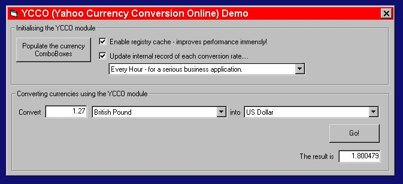



## YCCO \(Yahoo Currency Conversion Online\)

### Description

This project demonstrates a module called YCCO, which accesses the internet to facilitate up-to-the-minute currency conversions for over 150 world currencies.

Forget any other mechanisms you've seen - this is THE module for anyone writing an application which needs to know the latest exchange rates, and that has internet access!

This project has code which demonstrates the following:

* Getting the HTML content of a website.

* Using elemetary string parsing techniques.

* Using the registry as a store of data.

* Writing functions that accept generic objects as parameters, and decide how to manipulate them accordingly.
 
### More Info
 
Included in the module are a handful of functions which configure the process, including the registering of some required controls, so that the provision of the currency data is as simple as possible.

By using an option demonstrated in the demo, the module can use the registry to store any currency conversion rates, thus increasing the performance significantly, especially when performing conversions between many different currencies.

             |
---                |---
**Submitted On**   |2002-05-29 10:05:38
**By**             |[Paul Collingwood](https://github.com/Planet-Source-Code/PSCIndex/blob/master/ByAuthor/paul-collingwood.md)
**Level**          |Intermediate
**User Rating**    |5.0 (25 globes from 5 users)
**Compatibility**  |VB 5\.0, VB 6\.0
**Category**       |[Internet/ HTML](https://github.com/Planet-Source-Code/PSCIndex/blob/master/ByCategory/internet-html__1-34.md)
**World**          |[Visual Basic](https://github.com/Planet-Source-Code/PSCIndex/blob/master/ByWorld/visual-basic.md)
**Archive File**   |[YCCO\_\(Yaho826845132002\.zip](https://github.com/Planet-Source-Code/paul-collingwood-ycco-yahoo-currency-conversion-online__1-32677/archive/master.zip)

